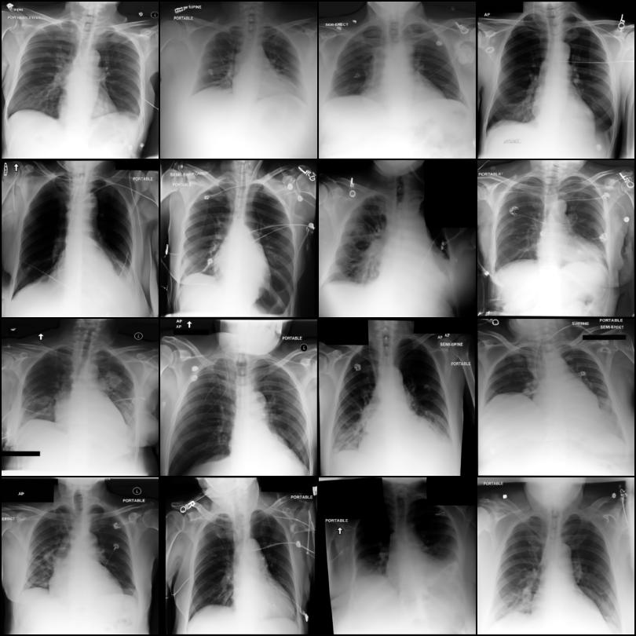

# Diffusion Model for Chest X-Ray

This project implements a **conditional diffusion model for chest X-ray image generation**. The goal is to generate **anatomically plausible radiographs** while enabling synthesis of specific pathological findings, including possible multi-pathology combinations.

This repository is for **research and experimentation only**.

## Features

-   **Multilabel conditional diffusion** for chest X-ray image synthesis
-   **Per-class token conditioning** via pathology label embeddings    
-   **Classifier-Free Guidance (CFG)** for controllable conditional generation    
-   **EMA-stabilized training** for improved sample quality and convergence    
-   **Accelerate-based training pipeline** for single-GPU usage    
-   **Hydra configuration** with hierarchical YAML experiment management    
-   **Checkpointing** with training resumption support    
-   **DevContainer-ready** VS Code development environment    

* * *

## 1\. Method Overview

### 1.1 Model

The model is based on Hugging Face’s `UNet2DConditionModel`, trained on single-channel chest X-ray images. A standard denoising diffusion objective is used.

Architectural properties:

-   Multi-scale UNet with four downsampling and upsampling paths
    
-   Cross-attention blocks at selected resolutions
    
-   DDPM noise schedule using cosine variance (`squaredcos_cap_v2`)
    

* * *

### 1.2 Multilabel Conditioning

A `MultiLabelConditioner` maps binary one-hot pathology labels to continuous embeddings. Conditioning is injected via the cross-attention layers, allowing the model to attend to pathology-specific tokens during generation.

* * *

### 1.3 Classifier-Free Guidance (CFG)

Classifier-Free Guidance is used for conditional generation of synthetic X-rays without an additional classifier model. During training, a fraction of samples can be trained without conditioning, enabling the model to learn both conditional and unconditional score functions.

CFG improves class separability, pathology visibility, and control over conditional strength.

At inference time, guidance is applied as:

```ini
noise = noise_uncond + guidance_scale * (noise_cond - noise_uncond)
```

* * *

### 1.4 Exponential Moving Average (EMA)

An EMA copy of the model weights is maintained and continously updated during training. EMA weights can be used for sample generation, validation, and checkpointing instead of the standard model.

EMA improves:

-   Sample sharpness    
-   Training stability    
-   Robustness to optimizer noise

* * *

## 2\. Installation

This project provides a DevContainer setup with all dependencies and optional GPU support pre-configured.

1.  Install **Docker** and **VS Code** with the _Dev Containers_ extension    
2.  Clone the repository:   
    `git clone https://github.com/....git cd Image-Synthesis`    
3.  Open the project in VS Code    
4.  Press `F1` -> _Dev Containers: Reopen in Container_    
5.  Wait for the container to build (first launch only)    

* * *

## 3\. Dataset

### 3.1 Download Dataset

**Source**: MIMIC-CXR (Kaggle mirror)  
[https://www.kaggle.com/datasets/itsanmol124/mimic-cxr](https://www.kaggle.com/datasets/itsanmol124/mimic-cxr)

### 3.2 Expected Directory Structure

```bash
data/
├── train/
├── valid/
├── test/
└── mimic-cxr.csv
```

### 3.3 Pathology Classes

-   Atelectasis    
-   Cardiomegaly    
-   Consolidation    
-   Edema    
-   Enlarged Cardiomediastinum    
-   Lung Lesion    
-   Lung Opacity    
-   Normal    
-   Pleural Effusion    
-   Pneumonia    
-   Pneumothorax    

* * *

## 4\. Quickstart

### 4.1 Training

Train using the default Hydra configuration:

```bash
python src/scripts/train.py
```

Override parameters from the command line:

```bash 
python src/scripts/train.py train.training.num_train_steps=100000 train.training.batch_size=8
```

Samples are generated periodically during training and saved to disk.

```bash 
python src/scripts/train.py train.generation.sample_steps=10000
```

Metrics calculation can be enabled after image generation.

```bash 
python src/scripts/train.py train.metrics.metrics_steps=10000 train.metrics.fd.dino=true
```

* * *

### 4.2 Testing

Evaluate a trained model or checkpoint:

```bash
python src/scripts/test.py final.path=models/{model_path}

python src/scripts/test.py final.path=checkpoints/{checkpoint_path}
```

Metrics and generated samples are saved to:

```text
results/test/YYYY-MM-DD/HH-MM-SS/
```

* * *

### 4.3 Inference / Sampling

Generate samples from a trained model:

```bash
python src/scripts/sample.py final.path=models/{model_path}
```

Generate samples for a specific pathology configuration:

```bash
python src/scripts/sample.py generation.sample_labels=[1,0,0,0,0,0,0,0,0,0,0]
```

Generated images are saved to:

```text
results/sample/YYYY-MM-DD/HH-MM-SS/
```

* * *

## 5\. Configuration

The project uses **Hydra** for hierarchical configuration management.

### 5.1 Configuration Priority

1.  `config/{mode}.yaml` — base defaults (`train`, `test`, `sample`)
    
2.  `config/{group}/{option}.yaml` — grouped configurations
    
3.  Command-line overrides — highest priority
    

### 5.2 Configuration Groups

-   `config/data/` — dataset and preprocessing    
-   `config/model/` — model architecture    
-   `config/train/` — optimization and training behavior   
-   `config/test/` — testing behavior
-   `config/train.yaml` — training entry point    
-   `config/test.yaml` — testing entry point    
-   `config/sample.yaml` — inference entry point    

All resolved configurations are saved to:

```text
outputs/YYYY-MM-DD/HH-MM-SS/
```

* * *

## 6\. Checkpointing & Training Resumption

### 6.1 Automatic Checkpointing

Checkpoints and models path names are saved with date and time markers by default. For checkpoints, top K checkpoints are sorted and updated by relevance (validation loss or metric score).

Checkpoints are periodically saved on validation steps to:

```text
checkpoints/YYYY-MM-DD/HH-MM-SS/step_XXXXXX/
```

A final model copies the best checkpoint's model states to:

```text
models/YYYY-MM-DD/HH-MM-SS/
```

Each checkpoint includes:

-   Model weights    
-   Conditioner weights    
-   Noise scheduler configurations
-   EMA weights
-   Training state (Optimizer, LR scheduler)    

* * *

### 6.2 Resume Training/ Fine-Tune

Training can be resumed via checkpoint path:

```bash
python src/scripts/train.py checkpoint.resume_from=checkpoints/...
```

Fine-tuning can be enabled to resume from a checkpoint for a given step amount.

```bash
python src/scripts/train.py checkpoint.resume_from=checkpoints/... train.training.fine_tune=true train.training.fine_tune_steps=10000
```

* * *

## 7\. Experiment Tracking

Training and evaluation are tracked using **MLflow**.

### Logged Information

**Metrics**

-   Training loss, learning rate    
-   Validation loss    
-   Test loss and metrics
    

**Parameters**

-   Model hyperparameters    
-   Full Hydra configuration
    

**Artifacts**

-   Sample labels    
-   Generated samples    

Launch the MLflow UI:

```bash
mlflow ui --backend-store-uri mlruns
```

Note: Deprecated for local file tracking.

* * *

## 8\. Results

Shown results were generated from models trained on a fraction of the dataset. A local GPU (8 GB VRAM), limiting the image size to 200 x 200, with a batch size of 12, in order to cut overall training time.



The metrics results have to be viewed cautiously as only 256 images and their labels were used from the test loader to generate and compare them.

|Metric             |Results            |
|:------------------|:-----------------:|
| FD DINOv2-small   | 258.066           |
| FID               | 117.951           |
| LPIPS             | 0.334             |

For single images, see `results/` directory.
Longer training time and better hardware are likely to yield cleare results.

* * *

## 9\. Project Structure

```markdown
.
├── data/                               # Dataset 
| 
├── config/                             # Hydra YAML configurations 
│   ├── data/                           # Dataset settings
│   ├── model/                          # Model architecture 
│   ├── train/                          # Train parameter settings 
│   ├── test/                           # Test parameter settings 
│   ├── train.yaml                      # Training config entry poin
│   ├── test.yaml                       # Testing config entry poin
│   └── sample.yaml                     # Inference config entry poin
│ 
├── scripts/ 
│   ├── train.py                        # Training entry point 
│   ├── test.py                         # Testing entry point 
│   └── sample.py                       # Inference entry point 
| 
├── src/ 
│   ├── data/                           # Dataset and dataloaders 
│   ├── metrics/                        # Metrics ans factory functions
│   ├── models/                         # Model wrapper 
│   ├── runner/                         # Run factory pipelines 
│   ├── training/                       # Training functions 
│   └── utils/                          # Helpers and utilities 
│ 
├── tests/                              # Unit tests 
| 
├── .devcontainer/                      # VS Code dev container 
├── checkpoints/                        # Checkpoints 
├── models/                             # Final model
├── mlruns/                             # MLflow tracking 
├── outputs/                            # Hydra run outputs 
├── results/                            # Test/inference results
│
├── .pre-commit-config.yaml 
├── pyproject.toml 
└── README.md

```

* * *

## 10\. Development

### Code Quality

Pre-commit hooks are provided for formatting and linting.

```bash
pip install pre-commit 
pre-commit install 
pre-commit run --all-files
```

* * *

## 11\. Citation

- Johnson, Alistair, Pollard, Tom, Mark, Roger, Berkowitz, Seth, and Steven Horng. "MIMIC-CXR Database" (version 2.0.0). PhysioNet (2019). https://doi.org/10.13026/C2JT1Q.

## 12\. Acknowledgments

- **Dataset**: mimic-cxr
- **Models**: Hugging Face
- **Framework**: PyTorch, Hugging Face, Hydra, MLflow